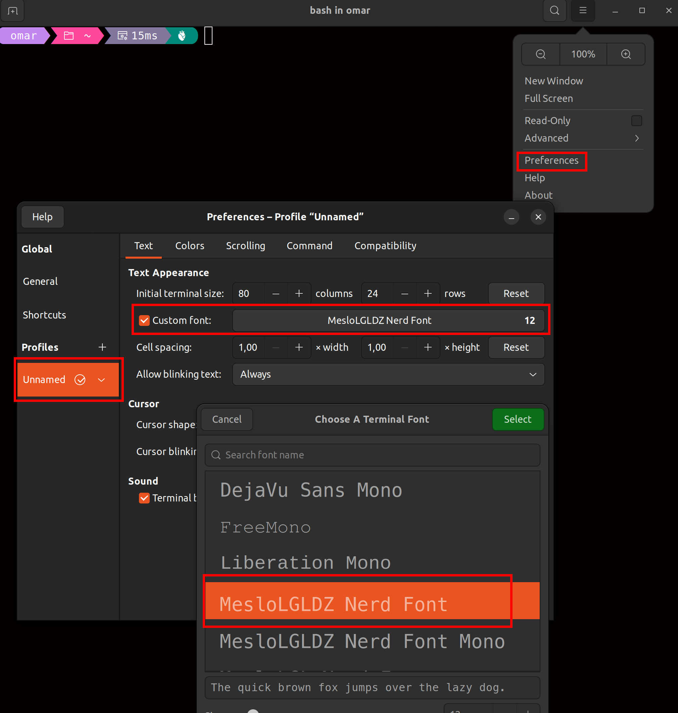

# Oh My Posh Installation

We will install [oh-my-posh](https://ohmyposh.dev/) which  is a versatile and powerful prompt theme engine that allows you to personalize and enhance the appearance and functionality of your command-line interface


1. Execute the following command to install oh-my-posh

```bash
curl -s https://ohmyposh.dev/install.sh | bash -s
```

2. Now we need to install [Nerd Fonts](https://www.nerdfonts.com/) 

```bash
oh-my-posh font install meslo
```

3. We need to setup a oh-my-posh them

```bash
echo 'eval "$(oh-my-posh init bash --config $HOME/.cache/oh-my-posh/themes/jandedobbeleer.omp.json)"' >> ~/.bashrc
```

4. Configure Your Terminal to Use the Nerd Font

    1.  Open your terminal.
    2.  Click on the hamburger menu (☰ icon) in the top-right corner of the terminal window.
    3.  Select **Preferences** from the dropdown menu.
    4.  In the Preferences window, go to the **Profiles** section.
    5.  Select your current profile (it's often named 'Unnamed' or your username).
    6.  Click on the **Text** tab.
    7.  Under the "Font" section, check the box for **Custom font**.
    8.  Click on the button that shows the current font name (e.g., 'Monospace Regular'). A font selection dialog will open.
    9.  Search for and select the Nerd Font you installed (e.g., **`FiraCode Nerd Font Regular`**, **`FiraMono Nerd Font`**, or similar). Make sure to choose a "Nerd Font" variant, often indicated by "NF" or "Nerd Font" in its name.
    10. Close the Preferences window.

<div align="center">
  
</div>