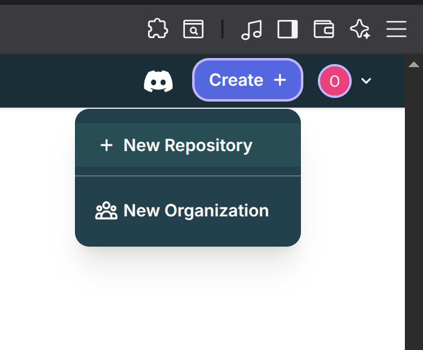
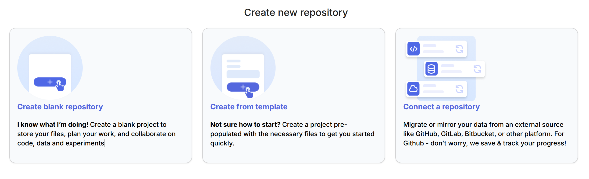
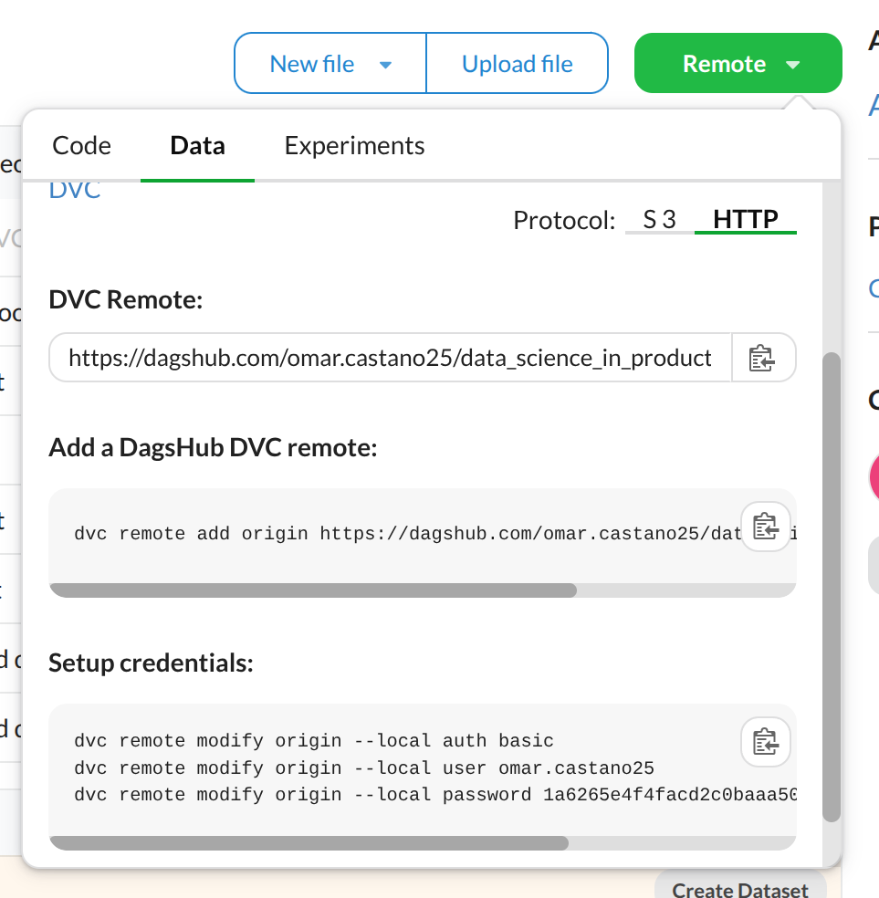

# Data Versioning

In machine learning projects, we often work with large datasets and train multiple models while trying different configurations. As a result, it's important to keep track of which data and model versions were used in each experiment. Without versioning, it's easy to lose track of changes, make mistakes, or fail to reproduce results. Just like we use Git to track changes in our code, we need tools to version our data and models. That’s where data versioning tools like **DVC** come in.

## DVC

DVC (Data Version Control) is an open-source tool designed to bring version control to the world of machine learning. While Git is great for tracking code, it’s not built to handle large files like datasets or trained models. DVC fills this gap.

In this course, we will use **DVC mainly for data versioning**. This means we’ll use DVC to track changes in our datasets over time—just like we use Git to track changes in our code. By doing this, we’ll ensure that every experiment we run is reproducible and that we can always go back to a previous version of our data if needed.

Here are some of the key things DVC can help us with:

* **Version control data and models:** DVC tracks changes in datasets and trained models. This makes it easy to revert to previous versions, compare experiments, and understand how your data has changed.
* **Reproduce experiments:** With DVC, you can create a clear structure for your machine learning workflow. It helps ensure that anyone (including your future self!) can reproduce your experiments exactly as they were.
* **Manage large files:** DVC stores metadata in Git, while the actual data is stored outside the Git repository (e.g., in a local folder or cloud storage). This makes it possible to work with large files without slowing down Git.
* **Facilitate collaboration:** In team projects, DVC helps everyone work with the correct version of the data and models, reducing confusion and errors.

## Installation

To install DVC, run the following command:

```bash
uv add dvc
```

## Initialize a DVC repository

To initialize a DVC repository, run the following command:

```bash
uv run dvc init
```

This command will create a folder called `.dvc` in the root of your project. It also creates a file named `.dvcignore`, similar to Git's `.gitignore`. Together, these components allow DVC to track and manage your data files. The most important files in the `.dvc` folder are:

* **config:** This is the main configuration file for your DVC project. It stores settings such as the location of your remote storage (e.g., an S3 bucket or Google Drive) and the default cache settings.

* **.gitignore:** DVC updates the Git ignore list to make sure large files are not tracked directly by Git but through DVC instead.

* **cache/**: This is where DVC stores actual data files you've added with dvc add. These are stored using a content-addressable storage system (files are renamed using a hash of their contents). This folder may appear in your project's root directory or in another location, depending on your DVC configuration.

After running `dvc init` you should commit the changes to your Git repository.

## Add a dataset to track them with DVC

To add a dataset to track them with DVC, run the following command:

```bash
uv run dvc add <dataset_path>
```

This command will create a .dvc file (e.g., dataset_path.dvc) that tracks the version of the dataset you added. This .dvc file contains metadata about the dataset, including its file hash, size, and storage location in the DVC cache.

In addition:

* The actual dataset file will be moved to DVC’s cache (by default located in .dvc/cache/), and a link (or copy, depending on your system) will be placed at the original location.

* The .gitignore file will be automatically updated so that Git ignores the original dataset file. This way, Git only tracks the lightweight .dvc file instead of the large dataset itself.

Every time you add a new dataset to your project, you should commit the changes to your Git repository indicating the new dataset version. You can commit the changes using the following command:

```bash
git add <dataset_path.dvc>
git commit -m "Add <dataset_path>"
git push
```

## Checkout a specific version of the dataset

You can check the commit history of your Git repository using the following command:

```bash
git log
```

Let's suppose that we have added three versions of the same dataset, and that the commit history of our Git repository is as follows:

```bash
commit 94ecec7b3e573fd742279d7d8e84bc80913389bb (HEAD -> main, origin/main)
Author: Omar Andres Castaño <omar.castano@udea.edu.co>
Date:   Wed Jul 30 20:19:57 2025 -0500

    third version of the dataset

commit 81bfa5a0ee4cd01c932d5f19782eba5859d94d65
Author: Omar Andres Castaño <omar.castano@udea.edu.co>
Date:   Wed Jul 30 20:17:25 2025 -0500

    second version of the dataset

commit 06ae403c1a61441c9829ad01a6367b5c0a63c35b
Author: Omar Andres Castaño <omar.castano@udea.edu.co>
Date:   Wed Jul 30 18:58:37 2025 -0500

    first version of the dataset
```

In order to get, for instance, the first version of the dataset, we can use the following command:

```bash
git checkout 06ae403c1a61441c9829ad01a6367b5c0a63c35b
```

and then

```bash
uv run dvc checkout
```

This will checkout the specific version of the dataset, and DVC will automatically update the dataset file (in the path <dataset_path>) to the version that was added in that commit.

# Remote Data Storage

DVC allows us to store our data in a remote storage location, such as an S3 bucket or Google Drive. This is useful if we want to share our data with others or access it from multiple machines. For now, we will use DagsHub to store our data.

## DagsHub

DagsHub is a remote storage service for our data. It is a free platform that allows us to store data in the cloud. We can create a free account at DagsHub. DagsHub supports DVC, so we can use both to store and track our data versions.

## Create a New DagsHub Repository

Once we have created a free account at DagsHub, we can create a new repository. To do this, go to the [DagsHub](https://dagshub.com/) website and click on `Create +` >> `New Repository` in the top right corner.

<div align="center">
  
</div>

Then, select the option `connect a repository` to connect a GitHub repo. This way, we sync our DagsHub repository with our GitHub repository. We will use GitHub to store our data versioning metadata and code, and DagsHub to store our data.

<div align="center">
  
</div>

Once we have connected our GitHub repository to DagsHub, we need to initialize DVC to use DagsHub as a remote storage. To do this, run the following command:

```bash
uv run dvc remote add origin <dagshub_url_repository>
uv run dvc remote modify origin --local auth basic 
uv run dvc remote modify origin --local user <your_username> 
uv run dvc remote modify origin --local password <your_token>
uv run dvc remote default origin
```

<div align="center">
  
</div>

Then we can add our dataset to DVC and push it to DagsHub. To do this, run the following commands:

```bash
uv run dvc push
```

Once DagsHub is initialized, we can push our dataset to DagsHub as we did before:

```bash
uv run dvc add <dataset_path>
git add <dataset_path.dvc>
git commit -m "Add <dataset_path>"
git push
uv run dvc push
```

## Download data from DagsHub

You can download a specific version of your dataset from DagsHub using the following command:

```bash
uv run dvc pull
```

This will download the latest version of the dataset from DagsHub. If you want to download a specific version, you can use the following command:

```bash
uv run dvc checkout <commit_hash>
```

This will checkout the specific version of the dataset from DagsHub.

Alternatively, you can use DagsHub python SDK to download a specific version of your dataset.

```python
import tempfile
import pandas as pd
from dagshub.streaming import DagsHubFilesystem

with tempfile.TemporaryDirectory() as tmpdir:

    
    fs = DagsHubFilesystem(
        tmpdir,
        repo_url="https://dagshub.com/omar.castano25/use_case_titanic",
        branch="81bfa5a0ee4cd01c932d5f19782eba5859d94d65", # branch or commit 
        token="<token>"
    )

    train = pd.read_csv(fs.open(f"{tmpdir}/src/app/data/datasets/train.csv"))
    test = pd.read_csv(fs.open(f"{tmpdir}/src/app/data/datasets/test.csv"))
```
