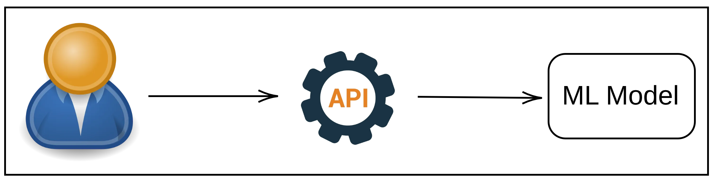

# ML Model Deployment Frameworks: Flask, FastAPI, and Streamlit

In modern machine learning workflows, once a model has been trained and evaluated, it often needs to be made accessible to other systems or users, this process is known as **model deployment**. Model deployment typically involves packaging the model, exposing it through an interface (usually a web API or application), and hosting it on a server or cloud platform so it can receive input and return predictions in real time. Various frameworks help streamline this process by providing tools to create APIs or user interfaces that communicate with the model.

  

## What is an API and an Application?

### API (Application Programming Interface)

An **API** is a set of rules that allows different software components to communicate with each other. In ML deployment, an API enables external systems to send data to a deployed model and receive predictions in return. APIs are crucial for integrating ML models into larger systems such as web apps, mobile apps, or other backend services.

### Application

An **application** is a complete software program designed to perform specific tasks for users. In ML deployment, an application might provide a user interface that allows users to input data and view predictions or analytics generated by the model. Applications are especially relevant when non-technical users need to interact with a machine learning system.

APIs and applications are both essential tools in ML deployment. APIs enable automation and integration with other systems, while applications provide an accessible interface for human users.

## Choosing the Right Framework

Now that we understand the role of APIs and applications in machine learning deployment, let's explore three widely-used framework: Flask, FastAPI, and Streamlit, that help us expose ML models through APIs or interactive applications.

## 1. Flask

**Flask** is a lightweight Python web framework used to build web applications and APIs. In the context of machine learning, Flask is commonly used to create RESTful APIs that serve models.

### Why use Flask in ML deployment?

* **Simplicity**: Easy to set up and understand for beginners.
* **Flexibility**: Allows full control over request handling, data preprocessing, and model inference.
* **Production-readiness**: Can be scaled using WSGI servers like Gunicorn or deployed on cloud services.

### Typical Use Case

You have a trained model and want to expose it as an API endpoint. A client sends a request (e.g., image, JSON with features), Flask processes the request, feeds it to the model, and returns a prediction.

## 2. [FastAPI](fastapi/fastapi.md)

**FastAPI** is a modern, fast (high-performance) web framework for building APIs with automatic OpenAPI documentation and data validation.

### Why use FastAPI in ML deployment?

* **Performance**: Built on Starlette and Pydantic, it’s significantly faster than Flask.
* **Automatic documentation**: Swagger UI and ReDoc are auto-generated.
* **Type hints**: Promotes clean, readable, and well-typed code, which helps with validation and error catching.

### Typical Use Case

Similar to Flask, but with faster performance and built-in documentation. Ideal for scalable ML APIs where speed and documentation matter (e.g., for teams or production systems).

## 3. Streamlit

**Streamlit** is a framework for building interactive data applications quickly, with minimal effort and code.

### Why use Streamlit in ML deployment?

* **Rapid prototyping**: Easy to create interactive UIs without needing front-end skills.
* **Visualization**: Ideal for visualizing predictions, metrics, or datasets.
* **User-friendly interfaces**: Allows users to interact with the model (e.g., sliders, text input) without writing code.

### Typical Use Case

You want to create a demo or dashboard to showcase your model’s predictions to stakeholders. Streamlit can load the model, take user input, and show results with a clean interface.

## Summary Table

| Framework | Best For                 | Strengths                             |
| --------- | ------------------------ | ------------------------------------- |
| Flask     | Lightweight ML APIs      | Simple, flexible, production-ready    |
| FastAPI   | High-performance ML APIs | Fast, auto-docs, type safety          |
| Streamlit | Demos and dashboards     | Fast UI, visualization, interactivity |
